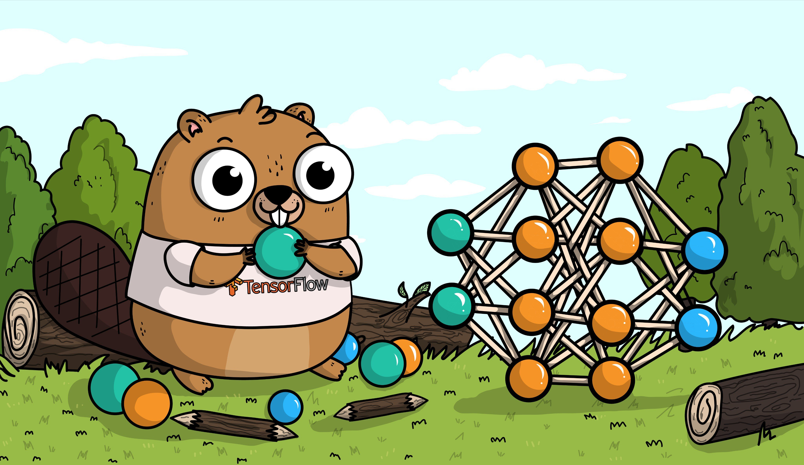
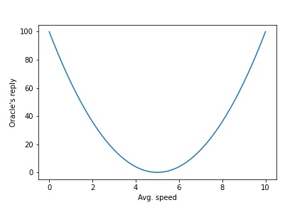

# Why do you need Tensorflow?

By Samyak Sarnayak

## Before we start

Pre-requisites:
 - basic math - be ready to open Google :)
 - ~PhD in physics~

Questions:
 - related questions or you don't follow - interrupt anytime.
 - not-so-related questions - I'll try to answer these at the end.

Disclaimer:
I'm not an expert, if you feel something is wrong or different, pls do tell

Let's go

Our friend Teefie

 
Credit: @AshleyMcNamara

Teefie goes to school everyday

 
<!-- TODO: images -->

in a car

 
<!-- TODO: images -->

The school is `$10$` kms away

Teefie took 2 hours to reach school one day

What was his average speed?

`$$ avg.\ speed = \frac{distance}{time} $$`

`$$ avg.\ speed = \frac{10 km}{2 hours} = 5 km/hr $$`

Yeah, Teefie is a little slow 🐢

But what's the point?

Now that we know Teefie's average speed

We can guess how long he'll take to travel `$20$` kms

or any other distance.

That was simple

But let's assume for a moment

That we don't know physics

Or it's something extreeeemely complex

That doesn't stop us

We still want the average speed

Somehow

Let's guess it

Given `$ 10 $` kms and 2 hours to reach

I'll say the average speed is 10km/hr

That's not quite right, but how do you know?

How should you correct this?

Fortunately we're in an ideal world

There's an **Oracle** that can tell you how far you are from the right answer.

The **Oracle** tells you that you are `$ 25 $` away from the answer.

 

## How would you reach the correct answer?

Remember:
 - You give **The Oracle** a guess and they tell you far away you are from the correct answer
 - You can ask **The Oracle** as many times as you want

An efficient trick

 - Nudge the guess by a bit, say `$ 10.1 $`

 - Oracle says `$ 26 $` now

 (remember it was `$ 25 $`)

 - Now you know which direction to go

 - You say 9, Oracle says 16

 - You say 8, Oracle says 9

 - You say 6, Oracle says 1

 - You say 4, Oracle says 1

 - Oops you overshot the answer

 - You say 5, Oracle says 0

 - You got it 🎉

This is how it looks when you plot it
 

### What even was this?

The Oracle is commonly known as the **cost function** or loss function.

Something that tells you how far away you are from the answer.

That process of gradually arriving at the answer based on the cost function is called **Gradient Descent**

This thing

 - Nudge the guess by a bit, say `$ 10.1 $`
 - Oracle says `$ 26 $` now

is **differentiation**

This is how a neural network works, on a very basic level.

# DEMO TIME

Some fun exercises for everyone!

Go here: https://tf.samyaks.xyz

# Thank you

# Links

 - Examples inspired by: https://towardsdatascience.com/differentiable-programming-from-scratch-abba0ebebc1c
 - Tensorflow: https://www.tensorflow.org/
 - Tensorflow.js: https://www.tensorflow.org/js
 - Reveal.js: https://revealjs.com/
<!-- why not numeric differentiation -->

<!-- 2nd part consisting of differentiation, why numeric is bad and how automatic differentiation helps -->
